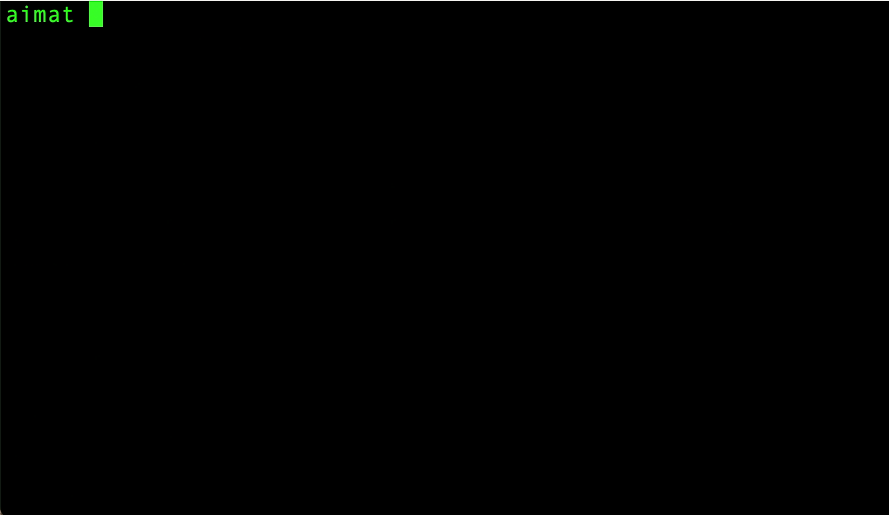
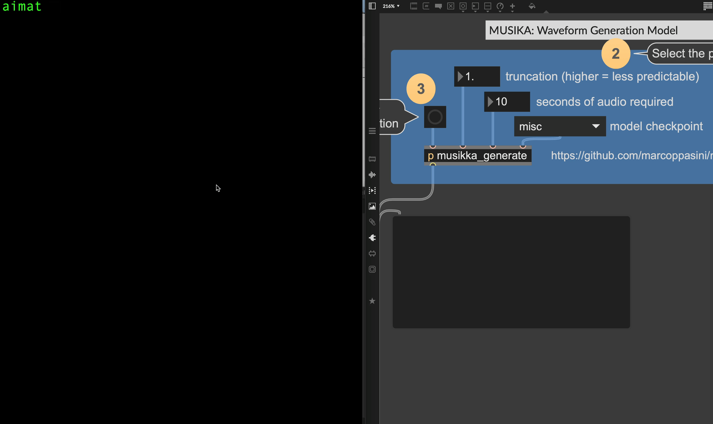

# AI Music Artist Toolkit (AIMAT) 
 

> **⚠️ AIMAT is currently under active development.**  
> Features and setup steps may change frequently. Expect some instability!

**A modular framework for experimenting with AI in music**  

The AI Music Artist Toolkit (AIMAT) is an environment designed to make working with AI in music easier and more practical for artists, musicians, and creative technologists. By bringing different generative models into a single, reusable workflow, AIMAT lowers some of the technical barriers that might otherwise make these tools difficult to access or experiment with.

AIMAT is also about preserving, repurposing, and combining interesting AI music projects, keeping them in one place where they can be explored in a practical, creative setting. It’s designed to help artists experiment with AI-generated sound, explore different parameters, and find new possibilities they might not have discovered otherwise.

Currently, AIMAT supports:

- **[Musika](https://github.com/marcoppasini/musika)** — Deep learning model for generating high-quality audio.
- **[Basic Pitch](https://github.com/spotify/basic-pitch)** — Automatic Music Transcription (audio-to-MIDI).
- **[MIDI-DDSP](https://github.com/magenta/midi-ddsp)** — Audio generation model for synthesizing realistic instrument sounds from MIDI.
- **[Continuator](https://github.com/fpachet/continuator)** — Style-learning MIDI continuation (experimental).

It integrates seamlessly with **Max/MSP, PD, Max for Live**, and other OSC-enabled applications, making AI-generated music easy to incorporate into your creative workflows.

---

## 🚀 Features  
- ✔️ **Modular and Expandable** – Easily add and switch between different AI models.
- ✔️ **OSC Integration** – Trigger AI music generation via Max/MSP or any OSC-compatible software.
- ✔️ **Docker-based** – Simplifies setup and isolates environments.
- ✔️ **Interactive CLI** – Easy-to-use commands for managing AIMAT.
- ✔️ **Cross-Platform** – Works seamlessly on **Windows, macOS, and Linux**.

---

## 📥 Installation & Setup  

### **1️⃣ Prerequisites**  

- 🔹 **Docker** – Install [Docker Desktop](https://www.docker.com/products/docker-desktop)  
- 🔹 **Miniconda** – Install [Miniconda](https://docs.conda.io/en/latest/miniconda.html) for managing Python dependencies  

---

### **2️⃣ Setting Up AIMAT**  

Once you have **Docker and Conda installed**, follow these steps:  

#### 🐍 **Create a dedicated Conda environment:**
```bash
conda create -n aimat python=3.10
conda activate aimat
```

#### ✅ **Install AIMAT via pip:**
```bash
pip install aimat
```

### **3️⃣ Quick Start**  

Start AIMAT with a single command (listener runs in the background by default):

```bash
aimat start
```

- Starts Docker containers with your AI models.
- Launches the OSC listener in the background, ready to receive messages.



#### 📌 **Attached Listener Mode (Optional)**

If you prefer to run the OSC listener in attached mode (foreground with continuous feedback), use:

```bash
aimat start --attached-listener
```

Use `Ctrl+C` to exit this mode.

To stop AIMAT (either mode):

```bash
aimat stop
```

---

## 🛠️ What Happens During Setup?  
✅ **Checks for Docker & Conda** – Ensures all dependencies are installed.  
✅ **Configures Docker Environment** – Automatically downloads and sets up AI music models.  
✅ **Starts OSC Listener** – Listens for incoming OSC messages to trigger music generation.

---

## 🎵 OSC Usage Examples

Use OSC messages from Max/MSP, Pure Data, or any OSC-compatible software to trigger AIMAT's AI models.

The AIMAT OSC listener expects messages on **port 5005** at your computer's **local IP address**.

### OSC Message Syntax

Send OSC messages in the following format:

```osc
/trigger_model <model_type> [additional_parameters]
```

- `<model_type>`: The AI model you're triggering (`musika`, `midi_ddsp`, `basic_pitch`, or `continuator`).
- `[additional_parameters]`: Specific parameters for each model (examples below).

### Examples:

#### 🔊 **Musika (Audio Generation)**

Generate audio with Musika:

```osc
/trigger_model musika 0.8 10 techno
```

- `0.8`: Truncation (randomness, higher = more random).
- `10`: Duration (seconds).
- `techno`: Model preset (`techno` or `misc`).

#### 🎻 **MIDI-DDSP (Instrument Synthesis)**

Synthesize realistic sounds from MIDI:

```osc
/trigger_model midi_ddsp your-midi-file.mid violin
```

- `your-midi-file.mid`: MIDI file (must be in input folder).
- `violin`: Instrument (`violin, viola, oboe, horn, tuba, bassoon, saxophone, trumpet, flute, clarinet, cello, guitar, bass, double bass`).

#### 🎹 **Basic Pitch (Audio-to-MIDI Conversion)**

Convert audio into MIDI:

```osc
/trigger_model basic_pitch path/to/audio-file.wav
```

- `path/to/audio-file.wav`: Audio file path to convert.
- Optional settings, as `key value` pairs after the file:
  - `onset`, `frame` (0.05–0.95): how strict note detection is. Low gives a dense swarm, high gives sparse notes.
  - `min_note_ms`: shortest note kept, in milliseconds.
  - `min_hz`, `max_hz`: the frequency range to transcribe.

```osc
/trigger_model basic_pitch path/to/audio-file.wav onset 0.7 frame 0.4 min_note_ms 120
```

#### 🎼 **Continuator (MIDI Continuation, experimental)**

Continue a MIDI phrase in its own style:

```osc
/trigger_model continuator your-midi-file.mid
```

- `your-midi-file.mid`: MIDI file (currently must be in `~/aimat/basic_pitch/output`).
- Each continuation is written to its own file in `~/aimat/continuator/output` (`<input>_cont_<id>.mid`) and reported on `/continuator_done`.
- Optional settings, as `key value` pairs after the file:
  - `kmax` (1–12): how much context it remembers. Low wanders freely; high copies closely. Default 6.
  - `transposition` (0/1): learn the input in all 12 keys, for a wider pitch range.
  - `mode` (`continue`/`freeform`): pick up from the input, or sample its style freely.
  - `seed_from` (`end`/`start`/`middle`): where a `continue` starts from.
  - `anchors` (0–32): notes from the input pinned into the output. 0 is freest. Default 5.
  - `decay` (`full`/`late`/`middle`/`early`): which part of the input it favours. Default `late`.
  - `length` (1–500): notes to generate. `tempo` (-1 keeps the input's, or 20–400 BPM).

```osc
/trigger_model continuator your-midi-file.mid kmax 2 transposition 1 anchors 0 length 40
```

---

### 🎛️ Simple AIMAT Musika generation (MAX/MSP example):



---

Ensure your input files (audio or MIDI) are correctly placed in AIMAT's designated input directories.

## 📂 Output Directories

Generated files are stored by default in your home directory under:

- **Musika:** `~/aimat/musika/output`
- **MIDI-DDSP:** `~/aimat/midi_ddsp/output`
- **Basic Pitch:** `~/aimat/basic_pitch/output`
- **Continuator:** `~/aimat/continuator/output`

## ⚠️ Troubleshooting

- **Listener or Docker Issues**: Restart with:
```bash
aimat restart
```
- **Missing Generated Files**: Check container logs:
```bash
docker logs <container-name>
```
- **Listener Logs**: View detailed listener activity:
```bash
aimat logs
```

## 🔜 Future Plans

- 🟢 GUI interface for easier model management and monitoring.
- 🟢 Integration of additional AI music models.
- 🟢 Expanded OSC command customization.

## 📜 License

MIT License © Eric Browne
